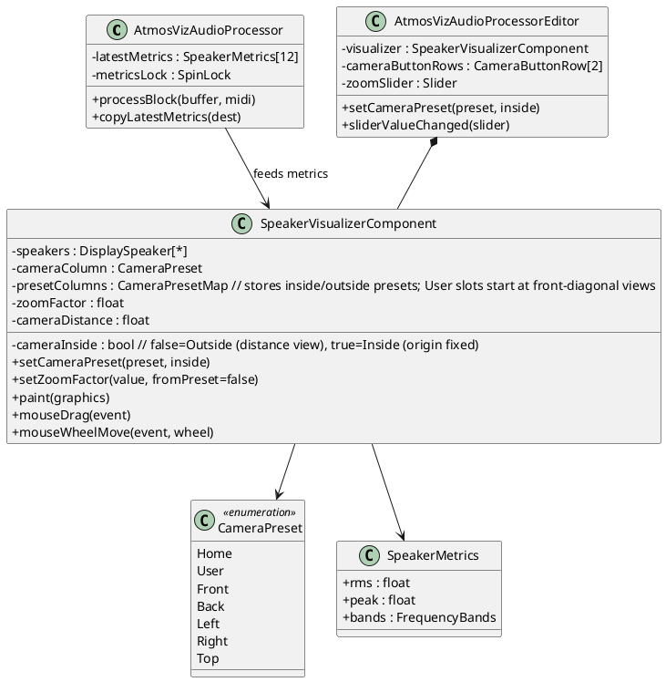
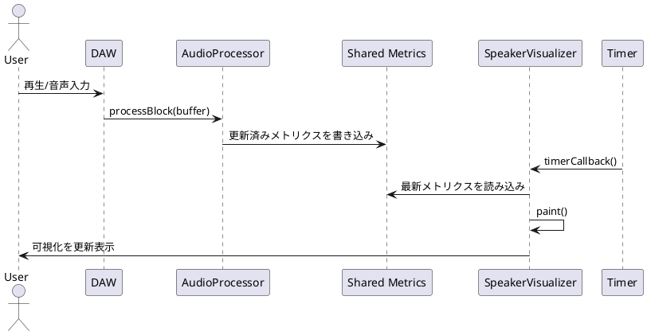
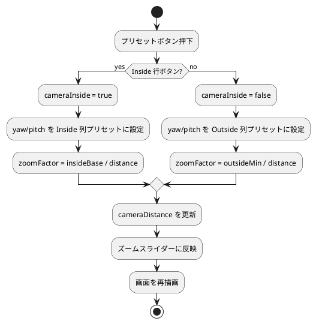
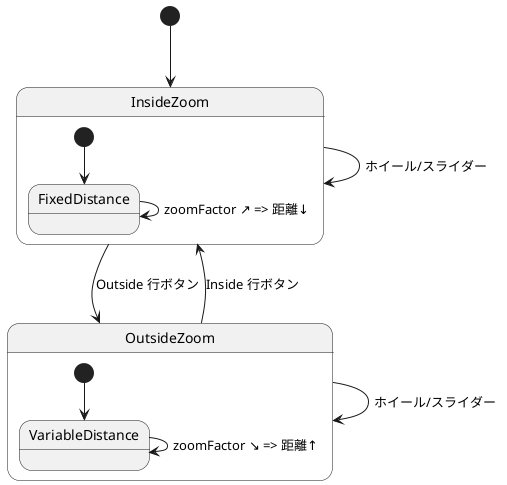
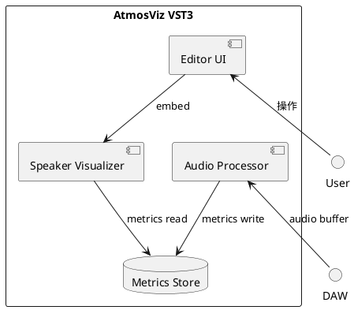

# PlantUML 図集

## クラス図

```plantuml
@startuml
skinparam classAttributeIconSize 0

class AtmosVizAudioProcessor {
  - latestMetrics : SpeakerMetrics[12]
  - metricsLock : SpinLock
  + processBlock(buffer, midi)
  + copyLatestMetrics(dest)
}

class SpeakerVisualizerComponent {
  - speakers : DisplaySpeaker[*]
  - cameraColumn : CameraPreset
  - cameraInside : bool // false=Outside (distance view), true=Inside (origin fixed)
  - presetColumns : CameraPresetMap // stores inside/outside presets; User slots start at front-diagonal views
  - zoomFactor : float
  - cameraDistance : float
  + setCameraPreset(preset, inside)
  + setZoomFactor(value, fromPreset=false)
  + paint(graphics)
  + mouseDrag(event)
  + mouseWheelMove(event, wheel)
}

class AtmosVizAudioProcessorEditor {
  - visualizer : SpeakerVisualizerComponent
  - cameraButtonRows : CameraButtonRow[2]
  - zoomSlider : Slider
  + setCameraPreset(preset, inside)
  + sliderValueChanged(slider)
}

class CameraPreset <<enumeration>> {
  Home
  User
  Front
  Back
  Left
  Right
  Top
}

class SpeakerMetrics {
  + rms : float
  + peak : float
  + bands : FrequencyBands
}

AtmosVizAudioProcessor --> SpeakerVisualizerComponent : feeds metrics
AtmosVizAudioProcessorEditor *-- SpeakerVisualizerComponent
SpeakerVisualizerComponent --> CameraPreset
SpeakerVisualizerComponent --> SpeakerMetrics

@enduml
```

## シーケンス図 (オーディオ処理と描画更新)

```plantuml
@startuml
actor User
participant DAW
participant "AudioProcessor" as AP
participant "Shared Metrics" as Store
participant "SpeakerVisualizer" as SV
participant "Timer" as TM

User -> DAW : 再生/音声入力
DAW -> AP : processBlock(buffer)
AP -> Store : 更新済みメトリクスを書き込み
TM -> SV : timerCallback()
SV -> Store : 最新メトリクスを読み込み
SV -> SV : paint()
SV -> User : 可視化を更新表示
@enduml
```

## アクティビティ図 (カメラプリセット切替)

```plantuml
@startuml
start
:プリセットボタン押下;
if (Inside 行ボタン?) then (yes)
  :cameraInside = true;
  :yaw/pitch を Inside 列プリセットに設定;
  :zoomFactor = insideBase / distance;
else (no)
  :cameraInside = false;
  :yaw/pitch を Outside 列プリセットに設定;
  :zoomFactor = outsideMin / distance;
endif
:cameraDistance を更新;
:ズームスライダーに反映;
:画面を再描画;
stop
@enduml
```

## ステート図 (ズーム挙動)

```plantuml
@startuml
[*] --> InsideZoom
InsideZoom --> InsideZoom : ホイール/スライダー
InsideZoom --> OutsideZoom : Outside 行ボタン
OutsideZoom --> InsideZoom : Inside 行ボタン
OutsideZoom --> OutsideZoom : ホイール/スライダー

state InsideZoom {
  [*] --> FixedDistance
  FixedDistance -> FixedDistance : zoomFactor ↗ => 距離↓
}

state OutsideZoom {
  [*] --> VariableDistance
  VariableDistance -> VariableDistance : zoomFactor ↘ => 距離↑
}
@enduml
```

## コンポーネント図

```plantuml
@startuml
rectangle "AtmosViz VST3" {
  component "Audio Processor" as AP
  component "Editor UI" as UI
  component "Speaker Visualizer" as SV
  database "Metrics Store" as MS
}

AP --> MS : metrics write
UI --> SV : embed
SV --> MS : metrics read
AP <-- DAW : audio buffer
UI <-- User : 操作
@enduml
```
